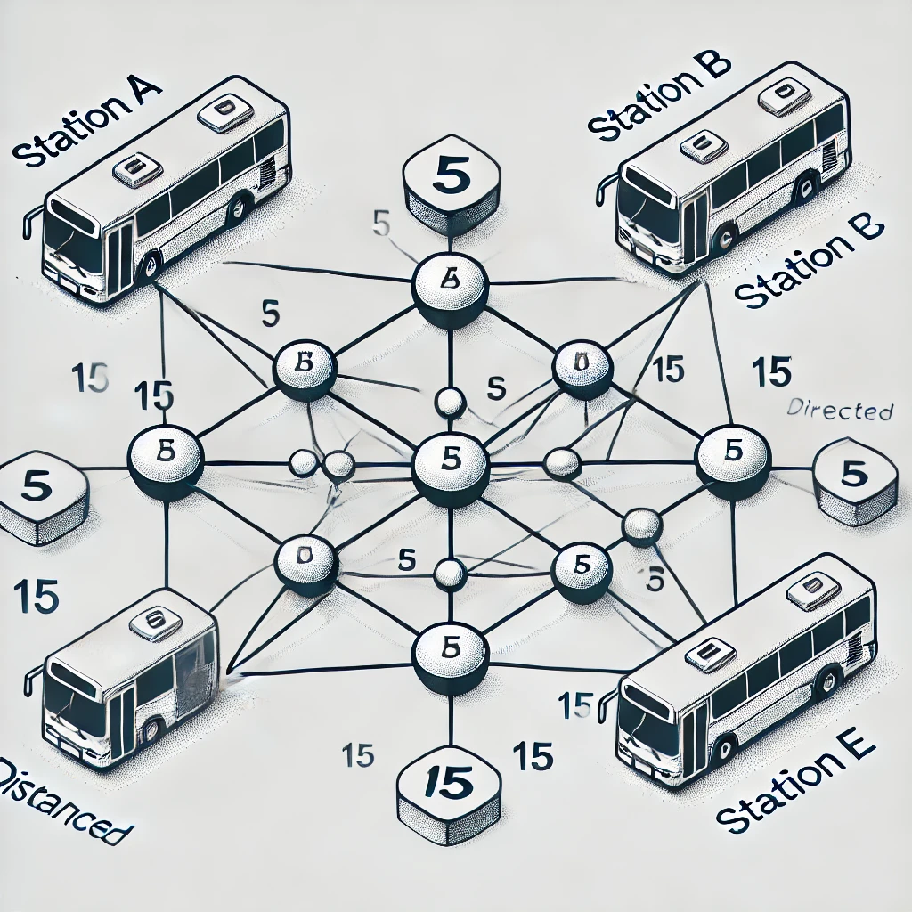

# Graph Data Structure Traversal Algorithms

Weighted, Unweighted, directed and non directed graphs

## Algorithms
- [Breadth First Search]()
- [Depth First Search]()
- [Dijkstra's Algorithm]()

## Graphs
## Stations
- **Station A**
- **Station B**
- **Station C**
- **Station D**
- **Station E**

## Edges with Weights
1. **Station A → Station B**: 5
2. **Station A → Station C**: 10
3. **Station B → Station D**: 15
4. **Station C → Station E**: 20
5. **Station D → Station E**: 25

## Graph Visualisation

